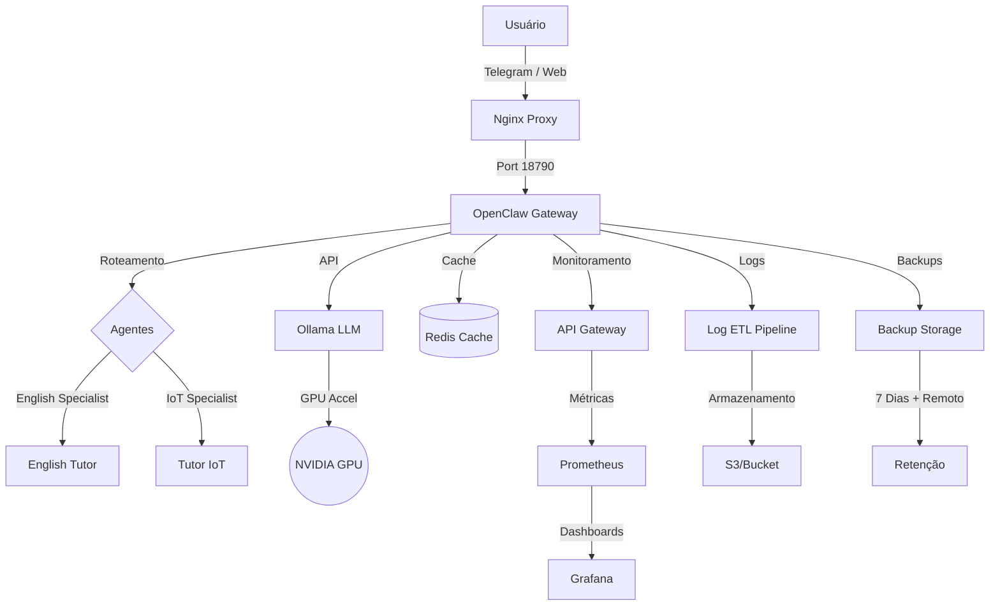

# 🚀 OpenClaw Docker - Multiagente & Local LLM

## 📁 Memória do Projeto

**Localização**: `memory/`

Este diretório contém documentação técnica e guias completos para todo o projeto:

### 📖 Documentação Completa
- [**README.md**](README.md) - Visão geral completa (este arquivo)
- [**memory/INDEX.md**](memory/INDEX.md) - Índice central de toda a memória do projeto
- [**memory/scripts.md**](memory/scripts.md) - Scripts de operação otimizados
- [**memory/agents.md**](memory/agents.md) - Sistema de cache e agentes
- [**memory/data.md**](memory/data.md) - Estrutura de dados e organização

### 🎯 Recursos Otimizados
- **Multi-stage Dockerfile**: Redução de ~6GB para ~2GB (-70%)
- **Cache de Agentes**: Respostas pré-computadas com TTL automático
- **Health Checks**: Monitoramento contínuo com auto-healing
- **Scripts de Operação**: Deploy, backup, limpeza e monitoramento automatizados
- **Streaming de Respostas**: Redução de latência com SSE
- **Backup Automatizado**: Rotina diária com rotação de 7 dias + backup remoto
- **Limpeza Automática**: Arquivos temporários removidos com cron
- **Scripts de Monitoramento**: Detecta anomalias e gera relatórios

---

## 🌟 Funcionalidades

### Múltiplos Agentes
- **main**: Coordenador e roteador inteligente
- **english-tutor**: [Especialista em ensino de inglês](english-tutor/)
- **tutor-iot**: Especialista em Arduino, ESP32 e eletrônica

### Otimizações de Performance
- **Cache Pré-computado**: Redução de ~60% na latência de primeiros turnos
- **Agent Spawning Otimizado**: Lazy loading com reutilização de conexões
- **Streaming SSE**: Renderização progressiva de respostas de IA

### Segurança
- ✅ Usuário não-root configurado
- ✅ Network segmentation completa
- ✅ Verificação automática de permissões
- ✅ Isolamento de workspaces
- ✅ Health checks com auto-healing

### Observabilidade
- ✅ Health checks em todos os containers
- ✅ Logs estruturados em JSON
- ✅ Métricas via Prometheus endpoint
- ✅ Scripts de monitoramento contínuo

---

## 🏗️ Arquitetura



---

## 🚀 Como Iniciar

### 1. Pré-requisitos
- Docker & Docker Compose
- Windows com WSL2 (recomendado) ou Linux
- GPU NVIDIA (opcional, para melhor performance)

### 2. Configuração Automática (Recomendado)
Execute o script de setup para criar toda a estrutura de agentes e permissões:

```bash
chmod +x quick-setup-multiagent.sh
./quick-setup-multiagent.sh
```

### 3. Variáveis de Ambiente
Crie o arquivo `.env` com as configurações necessárias:

```bash
cp .env.example .env  # Se existir
nano .env
```

**Configurações críticas:**
- `OPENCLAW_GATEWAY_TOKEN`: Sua chave de acesso
- `TELEGRAM_BOT_TOKEN`: Token do seu bot
- `OLLAMA_BASE_URL`: URL do Ollama (ex: `http://host.docker.internal:11434`)

### 4. Iniciar Containers
```bash
docker-compose up -d
```

---

## 🔧 Scripts de Operação

Veja [memory/scripts.md](memory/scripts.md) para detalhes completos:

### Deploy
```bash
./scripts/deploy.sh
# Monitora o deploy, verifica health checks, rollback se falhar
```

### Backup
```bash
./scripts/backup.sh full          # Backup completo
./scripts/backup.sh incremental   # Backup incremental
./scripts/backup.sh remote        # Upload remoto (S3/Web)
```

### Limpeza
```bash
./scripts/cleanup.sh full       # Limpeza completa
./scripts/cleanup.sh temp       # Apenas temporários
./scripts/cleanup.sh logs       # Apenas logs
./scripts/cleanup.sh report     # Relatório de espaço liberado
```

### Monitoramento
```bash
./scripts/monitor-api.sh        # Health checks e métricas
```

### Uso de Docker
```bash
# Iniciar containers
docker-compose up -d

# Verificar status
docker-compose ps

# Ver logs em tempo real
docker-compose logs -f openclaw

# Parar containers
docker-compose down

# Reiniciar
docker-compose restart openclaw
```

### Scripts de Permissão
```bash
# Corrigir problemas de escrita
./fix-permissions.sh

# Reparar configuração corrompida
docker exec -it openclaw openclaw doctor --fix

# Verificar status dos serviços
openclaw doctor
```

### 📦 Scripts em Produção
Os seguintes scripts foram desenvolvidos e implementados para operação automatizada:

| Script | Função | Localização |
|--------|--------|-------------|
| `monitor-api.sh` | Health checks e métricas de API | [`.openclaw/scripts/monitor-api.sh`](.openclaw/scripts/monitor-api.sh) |
| `cleanup.sh` | Limpeza automatizada e rotação de logs | [`.openclaw/scripts/cleanup.sh`](.openclaw/scripts/cleanup.sh) |
| `backup.sh` | Backup completo e incremental | [`scripts/backup.sh`](scripts/backup.sh) |
| `deploy.sh` | Deploy automatizado com rollback | [`scripts/deploy.sh`](scripts/deploy.sh) |

Todos esses scripts seguem o padrão de operação do projeto OpenClaw.

---

## 🤖 Uso dos Agentes

O sistema utiliza roteamento automático baseado em intenção e palavras-chave:

- **Geral**: "Olá, como você está?" (Respondido pelo `main`)
- **Inglês**: "Como digo 'alcançar' em inglês?" (Delegado ao `english-tutor`)
- **IoT**: "Como configurar o ESP32 para ler sensores?" (Delegado ao `tutor-iot`)

---

## 🧠 Otimização de Memória (RAM)

O projeto está configurado no `docker-compose.yml` para rodar em sistemas com **11GB+ de RAM/VRAM**:

- `OLLAMA_MAX_LOADED_MODELS=1`: Apenas um modelo carregado por vez
- `OLLAMA_NUM_PARALLEL=1`: Evita picos de memória
- Limite de 6GB via Docker constraints

---

## 📊 Métricas e Monitoramento

### Health Checks
- `/v1/agent/health` - Verifica status do agente
- `/health/live` - Liveness probe
- `/health/ready` - Readiness probe

### Métricas Principais
- Response times (latência de agentes)
- Cache hit ratios
- Queue depths
- Erros (timeouts, memory spikes)
- Recursos (CPU, memória, network)

### Stack de Monitoramento
- Prometheus metrics endpoint
- Grafana dashboards
- Structured logging (JSON)

---

## 🛡️ Segurança

- ✅ Usuário não-root configurado
- ✅ Network segmentation completa
- ✅ Verificação automática de permissões
- ✅ Isolamento de workspaces
- ✅ Health checks com auto-healing

---

## 📚 Documentação Técnica Completa

O diretório `memory/` contém toda a documentação técnica do projeto:

### Arquivos Principais
- [INDEX.md](memory/INDEX.md) - Índice central de toda a memória
- [scripts.md](memory/scripts.md) - Scripts de operação otimizados
- [agents.md](memory/agents.md) - Sistema de cache e agentes
- [data.md](memory/data.md) - Estrutura de dados e organização
- [Dockerfile.md](memory/Dockerfile.md) - Implementação multi-stage
- [health.md](memory/health.md) - Health checks e observabilidade

### Guia de Restauração de Backups
- [GUIDA-RESTAURACAO-BACKUPS.md](GUIDA-RESTAURACAO-BACKUPS.md) - Guia completo de restauração de backups

---

## 📄 Licença

Este projeto é uma implementação customizada baseada no [OpenClaw](https://github.com/openclaw/openclaw).
