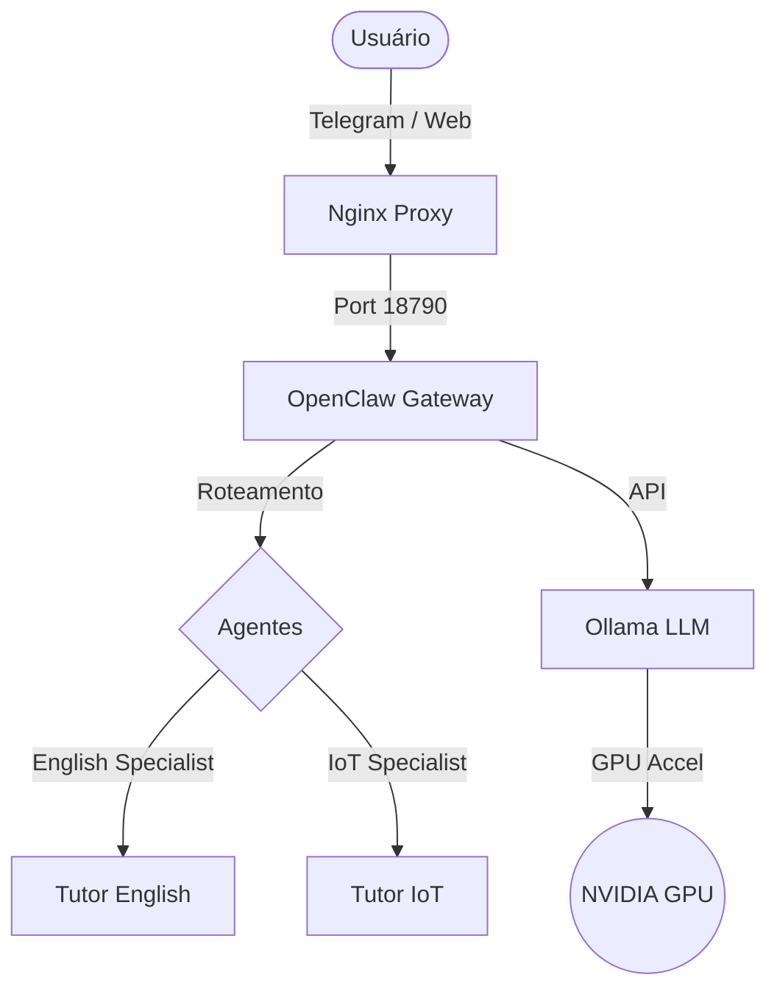

# 🚀 OpenClaw Docker - Multiagente & Local LLM

Este projeto fornece um ambiente Docker completo e otimizado para rodar o **OpenClaw Gateway** integrado com **Ollama** (modelos locais) e suporte nativo a múltiplos agentes especializados.

## 🌟 Funcionalidades

- **Múltiplos Agentes**: Configuração pronta para uso com 3 agentes:
  - `main`: Coordenador e roteador inteligente.
  - `tutor-english`: Especialista em ensino de inglês.
  - `tutor-iot`: Especialista em Arduino, ESP32 e eletrônica.
- **Modelos Locais**: Integração profunda com Ollama para privacidade e economia.
- **WSL2 Otimizado**: Scripts inclusos para garantir compatibilidade com systemd no Windows.
- **Segurança**: Verificação automática de permissões e isolamento de workspaces.
- **Proxy Integrado**: Nginx pré-configurado para exposição segura do gateway.

---

## 🏗️ Arquitetura



---

## 🚀 Como Iniciar

### 1. Pré-requisitos
- Docker & Docker Compose
- Windows com WSL2 (recomendado) ou Linux
- GPU NVIDIA (opcional, para melhor performance)

### 2. Configuração Automática (Recomendado)
Execute o script de setup para criar toda a estrutura de agentes e permissões:

```bash
chmod +x quick-setup-multiagent.sh
./quick-setup-multiagent.sh
```

### 3. Variáveis de Ambiente
Copie o arquivo de exemplo e configure suas chaves:

```bash
cp .env.example .env  # Se não existir
nano .env
```

**Configurações críticas no `.env`:**
- `OPENCLAW_GATEWAY_TOKEN`: Sua chave de acesso.
- `TELEGRAM_BOT_TOKEN`: Token do seu bot.

### 4. Iniciar containers
```bash
docker-compose up -d
```

---

## 🤖 Uso dos Agentes

O sistema utiliza roteamento automático baseado em intenção e palavras-chave.

- **Geral**: "Olá, como você está?" (Respondido pelo `main`)
- **Inglês**: "Como digo 'alcançar' em inglês?" (Delegado ao `tutor-english`)
- **IoT**: "Como ler um sensor DHT22 no ESP32?" (Delegado ao `tutor-iot`)

---

## 🛠️ Comandos Úteis

| Comando | Descrição |
|---------|-----------|
| `docker-compose logs -f openclaw` | Ver logs do gateway em tempo real |
| `./fix-permissions.sh` | Corrigir problemas de escrita nos volumes |
| `docker exec -it openclaw openclaw doctor --fix` | Reparar configuração corrompida |
| `docker-compose restart openclaw` | Reiniciar para aplicar mudanças no prompt |

---

## 🧠 Otimização de Memória (RAM)

O projeto está configurado no `docker-compose.yml` para rodar em sistemas com **11GB+ de RAM/VRAM**:
- `OLLAMA_MAX_LOADED_MODELS=1`: Apenas um modelo carregado por vez.
- `OLLAMA_NUM_PARALLEL=1`: Evita picos de memória.
- Limite de 6GB via Docker constraints.

---

## 📄 Licença

Este projeto é uma implementação customizada baseada no [OpenClaw](https://github.com/openclaw/openclaw).

---
*Gerado automaticamente pelo Agente Antigravity em 2026-03-02*
